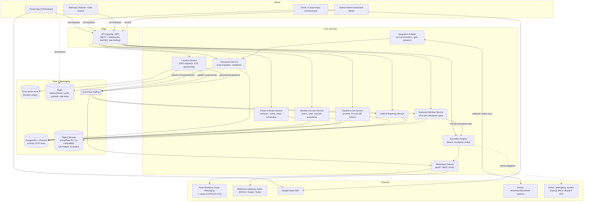
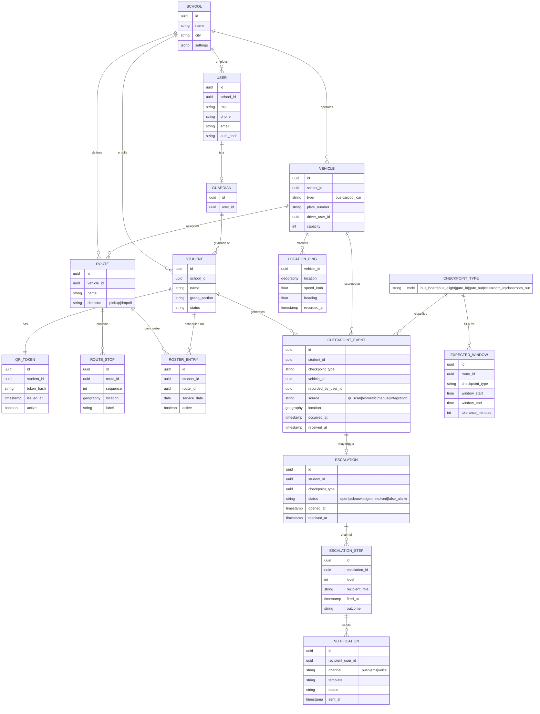
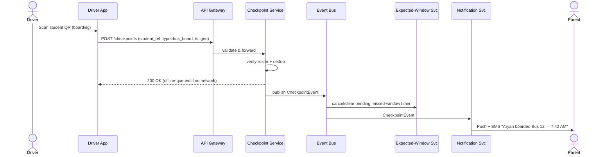
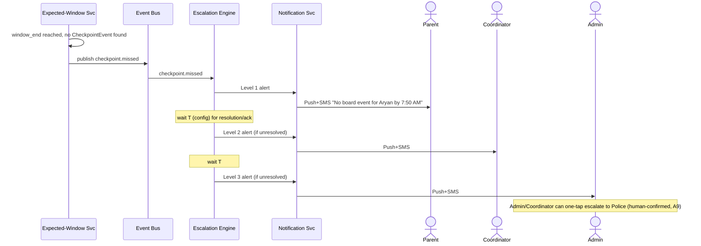
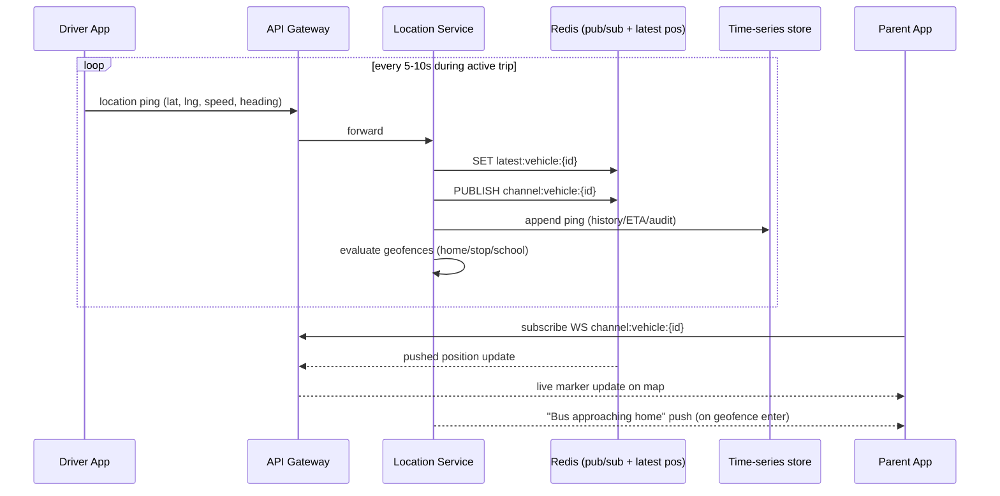

# StudeSafe — Software Architecture

> This is the **full-scale target** for a multi-school rollout. For the
> single-school prototype (500–1,000 students, one server), see
> [`PROTOTYPE_ARCHITECTURE.md`](./PROTOTYPE_ARCHITECTURE.md).

## 1. Purpose

StudeSafe replaces "track the child" with "track the handoff." Every point
where custody of a student changes hands (home → vehicle → school → vehicle →
home) is captured as a **checkpoint event**, confirmed by an adult already
present at that point (driver, gate guard, teacher). The system's job is to:

1. Capture checkpoint confirmations with minimal friction (QR scan).
2. Stream real-time vehicle location so parents can see the commute.
3. Notify parents at every checkpoint.
4. Detect missed/late checkpoints against expected time windows and escalate
   through a defined chain of humans.

This document describes the technical architecture that implements the
product description supplied by the team. Where the product description was
silent on an implementation detail, an explicit **Assumption** is called out
so it can be reviewed/corrected by stakeholders rather than silently baked
into the design.

**Confirmed technology stack** (chosen by the team; see
[`REQUIREMENTS.md` §3](./REQUIREMENTS.md#3-confirmed--recommended-technology-stack)
for full detail): React Native (Expo) for all mobile apps, Next.js for the
admin dashboard, Node.js backend, Kafka event bus, Google Maps SDK,
Cloudflare R2 object storage, RTK Query, GCP (GKE + Secret Manager). The
diagrams and component descriptions below use these concretely rather than
listing alternatives.

## 2. Actors / Roles

| Role | App surface | Primary actions |
|---|---|---|
| **Parent / Guardian** | Parent app (mobile) | View live map, timeline, receive & acknowledge alerts, manage student profile |
| **Driver (bus)** | Driver app (mobile) | Scan students in/out, broadcast "running late", location auto-streamed |
| **Carpool driver (parent)** | Driver app, "carpool mode" | Scan-in/out each rider, no hardware install |
| **Teacher / Gate guard** | Staff app (mobile) or web | Scan/confirm gate & classroom checkpoints |
| **Transport coordinator** | Admin dashboard (web) | Monitor fleet, receive level-2 escalations, reassign vehicles |
| **School admin** | Admin dashboard (web) | Roster management, routes, expected-time windows, receive level-3 escalations, bulk alerts |
| **System (automated)** | Escalation engine | Timer-based detection of missed checkpoints, automated notification fan-out |
| **Super admin (StudeSafe)** | Internal ops console | Multi-tenant (multi-school) provisioning, support |

**Assumption A1:** One codebase / one set of backend services serves all
roles; the *client experience* is role-gated (different navigation, screens,
and permissions), not a separate product per role. This matches "same app but
designed for different users… app views are different for each user type."

**Assumption A2:** The system is multi-tenant at the **school** level — each
school (or school group / bus operator) is a tenant with logically isolated
data (shared database, `school_id` partition key) rather than physically
separate databases per school. This is far cheaper to operate and is
revisited only if a school specifically requires data isolation for
compliance.

## 3. High-Level Architecture

**Assumption A3:** Client ↔ backend communication is via a single API
Gateway acting as a Backend-for-Frontend (BFF): REST/JSON for CRUD and
history, WebSocket (or Server-Sent Events) for live location + live alert
push to open app sessions, in addition to platform push notifications for
backgrounded apps.

## 4. Core Services (responsibilities)

### 4.1 Identity & Access Service
- AuthN (email/phone + OTP, or password) and AuthZ (RBAC: `parent`,
  `driver`, `teacher`, `gate_guard`, `coordinator`, `school_admin`,
  `super_admin`).
- Guardian–student linking (a student can have multiple guardians; a
  guardian can have multiple students, including across schools for
  siblings — **Assumption A4**).
- Issues short-lived JWT access tokens + refresh tokens; session
  management for mobile apps (device binding recommended for
  driver/teacher accounts since they represent duty-of-care actions).

### 4.2 Student & QR Service
- Owns the student profile and the **QR token** printed/embedded on the ID
  card. The QR encodes an opaque, non-guessable student reference (e.g.
  `sha256`-derived token or signed JWT), **not** raw PII, so a photographed
  QR code leaks no personal data by itself (**Assumption A5**, since the
  brief explicitly wants to avoid privacy/surveillance concerns).
- Supports token rotation/reissue (lost card) without re-registering the
  student.
- Generates printable QR/ID-card artifacts (stored in Object Storage).

### 4.3 Route & Roster Service
- Vehicles (bus/carpool car), driver assignment, capacity.
- Routes: ordered stop sequence, geo-coordinates per stop, schedule.
- Daily roster: which students are expected on which vehicle/route/day
  (supports ad-hoc changes — sick day, alternate pickup — **Assumption A6**:
  a parent or admin can mark a student "not travelling today" to suppress
  false missed-checkpoint escalations).

### 4.4 Checkpoint Service
- Single ingestion point for **all** checkpoint events regardless of
  source:
  - `bus_board`, `bus_alight` (QR scan by driver)
  - `gate_in`, `gate_out` (QR scan by guard, or webhook from existing
    biometric/RFID gate system via the Integration Adapter)
  - `classroom_in`, `classroom_out` (QR scan by teacher, or webhook from
    school's digital attendance system)
- Validates the event: is this student expected on this route/vehicle
  today, is the scanning device/user authorized, is the timestamp
  plausible (idempotency + dedup window to survive scan retries).
- Persists the event and publishes it on the event bus so downstream
  services (notification, expected-window/escalation, audit) can react
  independently — this is the system's event-sourced backbone.

### 4.5 Location Service
- Ingests GPS pings from the driver app (interval-based, e.g. every 5–10s
  while a trip is active — **Assumption A7**) over WebSocket or lightweight
  HTTP POST batches.
- Writes latest position to Redis (fast read for "where is the bus now")
  and appends to a time-series store for playback/ETA computation/audit.
- Computes ETA to next stop and to school using route distance + live
  speed (simple haversine/route-projection is sufficient for v1; a routing
  API can be layered later for traffic-aware ETA).
- Geofencing: evaluates each ping against registered geofences (school,
  each stop, each student's home) and emits `geofence.enter` /
  `geofence.approaching` events (e.g. "bus is 500m / ~3 min from home
  stop") onto the event bus for Notification Service to consume.

### 4.6 Expected-Window (SLA) Service
- Stores, per checkpoint type and per route/student, an expected time
  window (start, end, tolerance-minutes). Windows can be:
  - Set explicitly by school/transport office, or
  - Learned from historical checkpoint timestamps (rolling median ±
    configurable buffer) — **Assumption A8**: v1 ships with
    admin-configured static windows; adaptive/learned windows are a
    fast-follow, not a blocker for launch.
- Runs a scheduler (durable timers, e.g. checked every minute, or via a
  delayed-message pattern in the event bus) that, for each active
  student/route/day, checks whether the expected checkpoint event has
  arrived by `window.end`. If not, it emits a `checkpoint.missed` event.

### 4.7 Escalation Engine
- Subscribes to `checkpoint.missed`. Walks a configurable escalation
  chain, e.g.:
  1. **T+0**: alert parent (push + SMS)
  2. **T+5 min** (configurable), if unresolved: alert transport
     coordinator
  3. **T+10 min**: alert school admin
  4. **T+15 min** or admin-triggered: escalate to emergency contact /
     police
- "Unresolved" = no matching checkpoint event has since arrived **and** no
  human has acknowledged/closed the alert in the admin dashboard.
- **Assumption A9 (important safety/liability decision, flagged for
  explicit stakeholder sign-off):** the final "police" step is modeled as
  a **human-confirmed** action, not a fully automated outbound call. The
  engine escalates to the school admin/coordinator with a one-tap
  "Escalate to Police" action (which can auto-dial or trigger a
  dispatch-API integration where available) rather than autonomously
  phoning emergency services. Fully automated calls to police carry
  false-positive/liability risk (GPS gap, scanner offline, etc.) that a
  human-in-the-loop step mitigates; this can be revisited once the
  false-positive rate is measured in production.
- All escalation state transitions are audit-logged (who was notified,
  when, via what channel, and how/when it was resolved).

### 4.8 Notification Service
- Fans out to Push (**Firebase Cloud Messaging**, called directly via the
  Firebase Admin SDK — see Requirements §3.5) and SMS/voice (India:
  MSG91/Exotel/Kaleyra, or Twilio) based on user notification preferences
  and escalation severity.
- Since FCM alone doesn't provide delivery-rate dashboards, the service
  persists its own `sent` / `delivered` / `failed` state per notification
  (Requirements §3.5) so escalation-path delivery can be audited like any
  other safety-critical event (Architecture §10).
- Templated messages per event type (`boarded`, `arrived`, `departed`,
  `reached_home`, `running_late`, `missed_checkpoint_L1..L3`,
  `bus_approaching`).
- Delivery-status tracking (sent/delivered/failed) with retry + channel
  fallback (push fails → SMS) for anything escalation-related.

### 4.9 Integration Adapter
- Normalizes events from existing school gate/biometric systems into
  StudeSafe `CheckpointEvent`s. Supports both push (webhook) and pull
  (scheduled poll / SFTP batch import) since school systems vary widely in
  maturity (**Assumption A10**).

### 4.10 Audit & Reporting Service
- Immutable event log (backed by the same event bus + a queryable store)
  for: every checkpoint, every notification sent, every escalation and its
  resolution. Required for parent trust, school liability, and any future
  regulatory inquiry.
- Feeds the School Admin Dashboard's real-time roster ("who's on which
  bus, who hasn't checked in") and historical reports.

## 5. Data Model (core entities)

## 6. Key Flows

### 6.1 Checkpoint scan → notification

### 6.2 Missed checkpoint → escalation

### 6.3 Live GPS tracking

## 7. Offline & Connectivity Resilience

Buses and carpool routes travel through areas with unreliable cellular
coverage. This is a hard product requirement even though it wasn't spelled
out explicitly (**Assumption A11**):

- Driver/Staff apps persist scans and GPS pings to an on-device queue
  (SQLite) and sync opportunistically; each event carries a client-generated
  UUID + `occurred_at` client timestamp so the backend can dedupe and
  preserve true event ordering even when `received_at` (server time) is much
  later.
- The Checkpoint Service treats `occurred_at` as authoritative for
  escalation-window math, `received_at` for operational monitoring
  (detecting scanner/connectivity outages).
- A prolonged sync gap on a vehicle (no location pings for > X minutes
  during an active trip) is itself surfaced to the Admin Dashboard as an
  operational alert distinct from a missed-student-checkpoint alert.

## 8. Security & Privacy

- **QR tokens carry no PII** (A5) — only an opaque per-student reference,
  rotatable if a card is lost/stolen, so a found/photographed badge does not
  leak the child's identity or schedule to a stranger.
- Role-based access control everywhere; a driver can only see students on
  their assigned vehicle/route for today, a teacher only their
  school/class, a parent only their own children.
- All transport encrypted (TLS 1.2+/mTLS between internal services).
- PII (student name, home address/geofence, guardian contacts) is treated
  as sensitive personal data; India's **Digital Personal Data Protection
  Act, 2023 (DPDP)** applies — processing a minor's data requires verifiable
  parental/guardian consent and a Data Protection Officer / grievance
  contact for the operating entity (**Assumption A12**, flagged for legal
  review, not just engineering).
- Location history and checkpoint logs are retained for a bounded period
  (e.g. 12 months, configurable per school contract) then purged/archived —
  **Assumption A13**, exact retention period is a policy decision, not an
  engineering one.
- Audit log is append-only / tamper-evident given its role in disputes
  ("was the escalation actually sent on time").

## 9. Scalability & Deployment

- Services are containerized and deployed on **Kubernetes (GKE)** so the
  Location Service (highest write volume — many pings/sec across a fleet)
  can be scaled (HPA on CPU/queue-depth) independently of, e.g., the Admin
  Dashboard API.
- Event bus (**Kafka**, run as a managed offering or self-hosted on GKE —
  see Requirements §3.3) decouples ingestion from downstream processing
  (notification, escalation, audit) so a slow SMS provider never blocks
  checkpoint scan latency for the driver. Kafka's retention/replay also
  backs the append-only audit trail required by §10 (Audit & Reporting).
- Redis handles the hot path (latest vehicle position, pub/sub fan-out to
  connected parent-app WebSocket sessions) so scan-to-notification and
  GPS-ping-to-map-update stay low-latency without hammering the primary
  database.
- Regional deployment: **Assumption A14** — initial target market is India
  (given references to Delhi schools, ₹ pricing, SMS providers); the GKE
  cluster and primary datastores are deployed in GCP's `asia-south1`
  (Mumbai) region for latency and data-residency reasons. Object storage
  is on **Cloudflare R2** rather than GCS (team's choice, primarily for
  R2's zero egress-fee model) — this makes the deployment intentionally
  **multi-cloud** (compute/DB on GCP, object storage on Cloudflare), which
  has real operational cost (two IAM/credential surfaces, egress from GKE
  to R2 crosses cloud boundaries) that should be weighed against the
  egress-fee savings once traffic volume (ID-card images, QR assets) is
  estimated (**Assumption A15**).

## 10. Open Questions for Product/Stakeholders

1. Confirmed policy on automated vs. human-confirmed police escalation
   (A9) — legal/liability sign-off needed.
2. Data retention period per data type (A13).
3. Whether school biometric integrations are push (webhook) or pull
   (batch) in the actual pilot schools (A10) — affects Integration
   Adapter design.
4. Whether adaptive/learned expected-time windows are needed for v1 or a
   v2 feature (A8).
5. Multi-school siblings / a guardian with children at different schools
   (A4) — confirm this is in scope for v1.
6. Whether the multi-cloud footprint (GCP compute/DB + Cloudflare R2
   storage, A15) is acceptable long-term or whether GCS should be
   reconsidered once real object-storage traffic/cost is measured.
