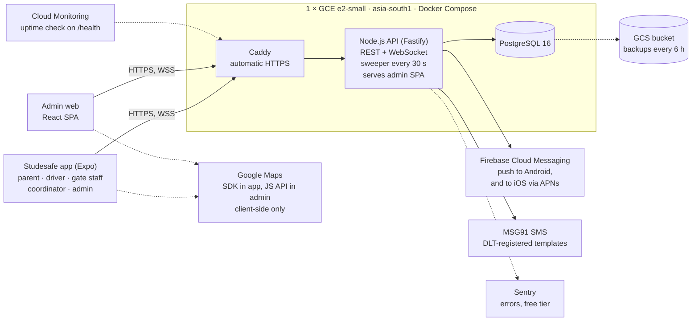
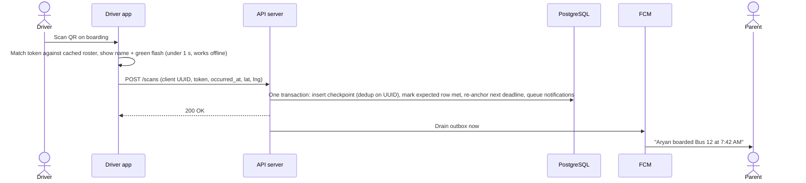
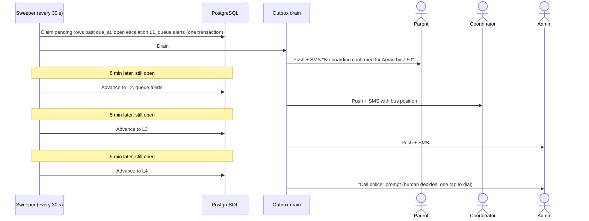
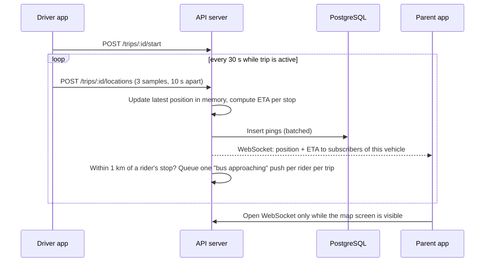
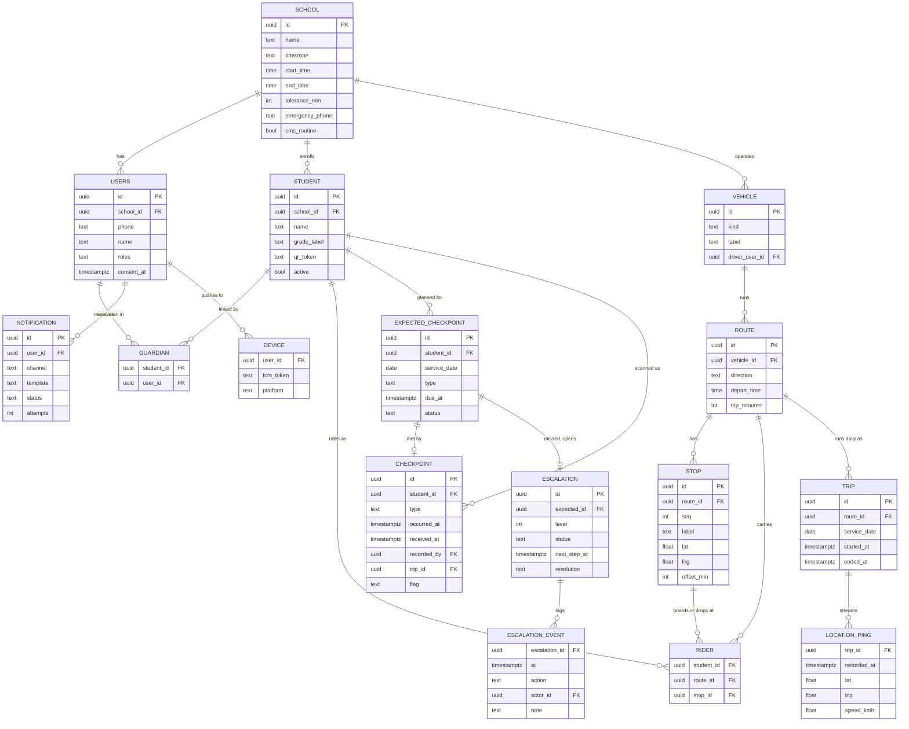

# Studesafe Prototype — Software Architecture

> **Scope:** one school, 500–1,000 students, ≤ 15,000 API requests on the
> busiest day. For the full multi-school target design (GKE, Kafka, Redis,
> microservices), see [`ARCHITECTURE.md`](./ARCHITECTURE.md). Requirements
> for this prototype are in [`PROTOTYPE_REQUIREMENTS.md`](./PROTOTYPE_REQUIREMENTS.md).

## 1. Prototype thesis

**Cheap, fast, quick to deploy, essential functions only.**

Every component below had to pass three tests:

1. **Required:** removing it breaks a promise the product makes to parents
   or schools (see the landing page: checkpoint scans, live bus map,
   instant alerts, escalation to a human).
2. **Essential at this scale:** it solves a problem that actually exists
   at 1,000 students, not at 100,000.
3. **Carries forward:** where the full architecture already chose a
   technology (Node.js, PostgreSQL, Expo, Google Maps, FCM, GCP Mumbai),
   the prototype uses the same one, so prototype code is not thrown away
   when the school count grows.

The result is **one small server running one Node.js process and one
PostgreSQL database**, one mobile app for every role, and a small web
admin served by that same server.

## 2. Sizing: why one server is enough

Worst-case school day at the top of the range (all figures are
assumptions, stated so they can be corrected):

- 1,000 students, about 1,000 parent app users.
- 600 students ride school transport on 20 vehicles (12 buses, 8
  carpools); each vehicle runs 2 trips of about 45 minutes.
- 5 gate/staff phones, 3–5 admin and coordinator users.

| Source | Calculation | Requests/day |
|---|---|---|
| Checkpoint scans | home depart 1,000 + gate in 1,000 + gate out 1,000 + home arrive 1,000 + board AM 600 + board PM 600 | 5,200 |
| GPS uploads from drivers | 20 vehicles × 2 trips × 90 (one batch every 30 s for 45 min) | 3,600 |
| Parent app opens | 1,000 parents × 3 opens × 1 request (`GET /me/today`) | 3,000 |
| Live-map sessions | ~30% of parents × 2 trips, 1 WebSocket connect each | 600 |
| Driver and staff app | trip start/end, roster fetch | ~200 |
| Escalation actions | resolve, police-called, running late | ~100 |
| Admin web | page loads, WebSocket connects | ~200 |
| Auth and device registration | OTP, token refresh, push token | ~300 |
| **Total** | | **≈ 13,200** |

About 80% of this lands in two 90-minute windows (morning pickup and
afternoon drop), which averages **~1 request per second**, with short
bursts of 5–10 req/s at the school gate. A single Node.js process on a
2-vCPU VM serves several hundred simple database-backed requests per
second, so the prototype has **roughly 50–100× headroom** over its own
peak.

Two design choices keep the budget this small:

- **Live location is pushed over WebSocket, not polled.** If 300 parents
  polled every 15 s during a 45-minute trip, that alone would be
  ~108,000 requests a day, seven times the whole budget. One WebSocket
  per viewing session costs one request.
- **GPS is batched.** The driver app samples every 10 s but uploads every
  30 s (3 points per request).

Storage is equally small: ~5,000 checkpoint rows and ~11,000 GPS rows a
day. PostgreSQL handles years of this without tuning.

## 3. What changed from the full architecture

| Full architecture | Prototype | Why |
|---|---|---|
| 10 microservices on GKE | **One Node.js process** (modular monolith: same module boundaries, one deployable) | ~1 req/s does not need independent scaling. Modules map 1:1 to the full design's services, so they can be split later along the same seams. |
| Kubernetes (GKE Autopilot) | **One Compute Engine VM** running Docker Compose | No cluster to operate; one `docker compose up`. |
| Kafka event bus | **PostgreSQL tables** (outbox pattern) | Events are rows; the audit trail is the same rows. No broker to run. |
| Redis (positions, pub/sub) | **Process memory** | One process, so an in-memory map of latest positions and WebSocket subscribers is enough. Rebuilt from the database on restart. |
| BullMQ / Temporal for timers | **A 30-second SQL "sweeper" loop** | Deadlines live in the database, so a restart loses nothing. See §5.4. |
| PostGIS + TimescaleDB | **Plain PostgreSQL** | "Is the bus within 1 km of the stop" is a haversine calculation in JavaScript for 20 vehicles. |
| Cloudflare R2 object storage | **Removed** | Studesafe stores no ID-card images. QR codes are rendered on demand from a token. |
| Next.js admin dashboard | **Small React (Vite) SPA served by the API server** | No second server process. The React components move to Next.js unchanged if server rendering is ever needed. |
| NestJS | **Fastify** | Lighter, fast, built-in request validation, first-party WebSocket and rate-limit plugins. |
| 3 mobile apps | **One Expo app, role-based tabs** | One build, one store listing, one codebase (already Assumption A1). |
| `react-native-vision-camera` | **`expo-camera`** (built-in barcode scanning) | First-party Expo module, one fewer native dependency. Switch only if field tests show low-light scanning problems. |
| Integration adapter (biometric gates) | **Out of scope** | Phone-camera scanning covers every checkpoint. |
| Voice calls | **Out of scope** | The police step is a human tapping a phone number (already Assumption A9). |
| GCP Secret Manager, Terraform, OpenTelemetry | **`.env` file on the VM (mode 600), a setup runbook, logs + Sentry** | One VM and one process do not need these yet. |
| Directions / Geocoding APIs | **Not called** | ETA is computed on the server; stops are placed by dropping a pin on a map. Keeps Google Maps at $0. |

**Kept unchanged:** Node.js, PostgreSQL, React Native with Expo, RTK Query,
Google Maps SDK, Firebase Cloud Messaging (direct, via the Admin SDK),
MSG91 for SMS, the `qrcode` package, `expo-sqlite` for the offline queue,
GCP in `asia-south1` (Mumbai), the human-confirmed police step, and
`school_id` on every table (the schema stays multi-school-ready even
though the prototype serves one school).

## 4. Architecture overview



There is exactly **one server to deploy, one database to back up, one
mobile app to build**, and three external services that matter at
runtime (FCM, MSG91, Google Maps). All map rendering happens on the
client, so the server never calls Google Maps.

## 5. Components

### 5.1 Mobile app (one Expo app, every role)

After OTP login the app shows tabs for the user's role(s). A user can
hold more than one role (a parent who also drives a carpool gets both
sets of tabs and a role switcher).

| Role | Screens |
|---|---|
| **Parent** | **Today**: each child's checkpoints for the day, confirmed in green, overdue in red (computed on the phone from the cached plan, so an overdue check shows even if the server is unreachable). **Live map**: the child's vehicle and an ETA, only while that trip is active. **Scan**: "Leaving home" / "Arrived home". **Alerts**: open escalations for their child, with one-tap "Resolve" (website FAQ: parents can stop an escalation). **Absent today** (AM, PM or full day). |
| **Driver** (bus or carpool) | **Trip**: start/end (GPS runs only between the two). **Scan**: continuous camera scanning. **Roster**: who has boarded and who hasn't. **Running late**: one tap, picks 10/20/30 min. Offline banner showing queued scans. |
| **Gate staff / teacher** | **Scan** with an Arrival / Departure toggle, continuous camera scanning. **Today** counts (arrived, departed, not yet seen). |
| **Coordinator / admin** | **Alerts** queue (open escalations, resolve, one-tap "Call police"). **Fleet map** (all active vehicles). **Broadcast delay** to a route's parents. |

**Libraries:** Expo (EAS dev build: background location and FCM both
need native code, so Expo Go is not an option), `expo-camera` barcode
scanning, `react-native-maps` with `PROVIDER_GOOGLE`, `expo-location`
background task with an Android foreground-service notification while a
trip is active, `@react-native-firebase/messaging` for FCM on both
platforms, `expo-sqlite` for the offline scan and GPS queue, RTK Query
for REST, the built-in React Native `WebSocket` for the live map,
`@sentry/react-native` for crash reports.

### 5.2 Admin web (small React SPA)

Built with Vite, compiled to static files, served by the API server at
`/admin`. It covers only the jobs that need a keyboard and a big screen:

- **Students**: list, CSV import, reissue a QR (lost card), print QR
  cards (a print-ready HTML page, one card per student).
- **Routes and vehicles**: stops placed by dropping pins on a Google map,
  each with a minute offset from departure.
- **People**: invite staff, drivers, coordinators and admins by phone
  number.
- **Today board**: live roster per vehicle, open escalations, fleet map.
- **Settings**: school start/end times, tolerance, escalation delays,
  emergency phone number, SMS policy, school closure dates.
- **Reports**: CSV export of the day's checkpoints and escalations.

Map: Google Maps JavaScript API via `@vis.gl/react-google-maps`. Data:
RTK Query (same as the mobile app).

### 5.3 API server (Fastify modular monolith)

One Node.js 22 LTS process in TypeScript. Modules mirror the full
architecture's services, so a later split follows existing seams:

| Module | Responsibility | Full-architecture equivalent |
|---|---|---|
| `auth` | Phone OTP via MSG91, JWT access + rotating refresh tokens, role checks | Identity & Access |
| `roster` | Students, guardians, QR tokens, vehicles, routes, stops, riders, absences, CSV import | Student & QR + Route & Roster |
| `checkpoints` | Scan ingestion (single or batch), dedup, roster validation, day-plan updates | Checkpoint + Expected-Window |
| `location` | Trip start/end, GPS batch ingestion, latest position in memory, approach alerts, ETA | Location |
| `escalation` | The sweeper (§5.4), resolve/ack actions, police-called logging | Escalation Engine |
| `notify` | Outbox drain: FCM via `firebase-admin`, SMS via MSG91 HTTP API, retries | Notification |
| `live` | WebSocket subscriptions and fan-out | API Gateway WebSocket path |
| `admin` | Settings, broadcasts, CSV reports, serves the SPA | Audit & Reporting (reporting part) |

**Libraries:** `fastify`, `@fastify/websocket`, `@fastify/rate-limit`,
`@fastify/jwt`, `@fastify/multipart` (CSV upload), `@fastify/static`
(admin SPA), `drizzle-orm` + `drizzle-kit` (typed SQL and migrations)
over `postgres` (postgres.js), `csv-parse`, `qrcode`, `firebase-admin`,
`@sentry/node`.

### 5.4 The sweeper: escalation engine without a job queue

This is the safety core, so it is deliberately boring. Every deadline is
a row in the database; a loop inside the API process runs every 30
seconds and does four things, each as an atomic SQL statement:

1. **Detect misses:** `UPDATE expected_checkpoints SET status = 'missed'
   WHERE status = 'pending' AND due_at < now() RETURNING …`. For each
   returned row, open an escalation at level 1 and queue notifications
   in the **same transaction**.
2. **Advance escalations:** `UPDATE escalations SET level = level + 1,
   next_step_at = … WHERE status = 'open' AND next_step_at < now()
   RETURNING …`, queuing the next level's notifications in the same
   transaction.
3. **Drain the outbox:** send every `notifications` row with status
   `queued` (FCM or SMS), mark `sent` or `failed`, retry failures up to 3
   times. Scans also trigger an immediate drain, so a routine "boarded"
   push goes out within seconds rather than waiting for the next tick.
4. **Housekeeping:** at 04:30 school time, build the next school day's
   plan (§6.1); nightly, delete GPS pings older than 30 days and expired
   OTP codes and refresh tokens.

Each run writes a heartbeat timestamp. `/health` returns HTTP 503 if the
last heartbeat is older than 2 minutes, which the uptime check turns into
an alert (§9.4). **A silently stopped sweeper is the worst failure this
system can have, so it is the thing monitoring watches.**

Why this is safe across restarts and crashes: the database, not memory,
holds every deadline and every unsent message. A crash between "decide"
and "send" leaves a `queued` row that the next run sends. The `UPDATE …
WHERE status = 'pending'` pattern means a row can only be claimed once.
If a second API instance is ever added, the sweeper takes a PostgreSQL
advisory lock so only one instance runs it.

### 5.5 PostgreSQL

PostgreSQL 16 in a Docker container on the same VM, data on the VM's
persistent disk, reachable only on the Docker network (never exposed to
the internet). Schema in §8.

### 5.6 External services

| Service | Used for | Cost at this scale |
|---|---|---|
| **Firebase Cloud Messaging** | All push notifications, Android and iOS (FCM relays to APNs) | Free |
| **MSG91** (or Exotel/Kaleyra) | Login OTP, escalation SMS, optional routine SMS | Per SMS; see §10 |
| **Google Maps Platform** | Maps SDK for Android/iOS in the app; Maps JavaScript API in admin web | $0 expected: mobile SDK map loads are not billed, and admin web stays inside the monthly free usage cap. No Directions or Geocoding calls. |
| **Google Cloud Storage** | Database backups | Cents |
| **Sentry** | Crash and error reports, app and server | Free tier |

## 6. Checkpoints and escalation

### 6.1 The day plan

The QR code identifies the student; the **checkpoint type comes from who
is scanning and when** (a driver on an active AM trip records `board_am`;
gate staff record `gate_in` or `gate_out` from their Arrival/Departure
toggle; a parent records `home_depart` or `home_arrive`).

Each school day, each active student gets an ordered list of expected
checkpoints (`expected_checkpoints` rows) with a `due_at` deadline. When
a checkpoint is scanned, the next one's deadline is **re-anchored** to the
real scan time, so a bus that left late doesn't raise false alarms all
morning.

This follows the landing page's flow (parent scans at home, driver scans
on boarding, gate scans in and out). There are no bus-alight scans: the
gate scan confirms arrival at school, and the parent's home scan confirms
arrival home.

**Students who ride school transport** (`tolerance` defaults to 15 min):

| # | Checkpoint | Scanned by | Initial deadline | Re-anchored when previous is scanned |
|---|---|---|---|---|
| 1 | `home_depart` | Parent | Not escalated (informational) | — |
| 2 | `board_am` | Driver | AM departure + stop offset + tolerance | — |
| 3 | `gate_in` | Gate staff | AM departure + trip minutes + tolerance | board time + (trip minutes − stop offset) + tolerance |
| 4 | `gate_out` | Gate staff | School end + tolerance | — |
| 5 | `board_pm` | Driver | PM departure + tolerance | — |
| 6 | `home_arrive` | Parent | PM departure + stop offset + tolerance | board time + stop offset + tolerance |

**Students who don't ride** (parent drop-off, walkers): `gate_in` by
school start + tolerance, `gate_out` by school end + tolerance. Home
scans are optional and not escalated.

**Things that change the plan:**

- **Absent / not travelling** (parent or admin): the matching rows become
  `skipped`, so nothing escalates.
- **Running late** (driver) or **route delayed** (coordinator): pushes a
  message to that route's parents and pushes that route's pending
  deadlines back by the same number of minutes, so one late bus doesn't
  raise 50 escalations.
- **School closure** dates: no plan is generated.
- **A late scan** (for example, synced after a driver was offline): marks
  the row `met`, auto-resolves any open escalation for it, and tells
  everyone already alerted "Resolved: scan received at 7:52".

### 6.2 The escalation chain

| Level | When | Who is alerted | Channel |
|---|---|---|---|
| 1 | Deadline passed (within 30 s) | The student's guardians | Push + SMS |
| 2 | +5 min, unresolved | Transport coordinator(s) | Push + SMS |
| 3 | +10 min, unresolved | School admin(s) | Push + SMS |
| 4 | +15 min, unresolved | Admin + coordinator get a **"Call police"** prompt: one tap opens the phone dialer with the school's configured number (default 112). Reminder every 5 min until resolved. | Push + SMS |

- A level with nobody assigned (for example, a school without a
  transport coordinator) is skipped.
- Coordinator and admin alerts are **grouped per vehicle and checkpoint**
  when more than 3 students on the same trip miss the same checkpoint
  ("Bus 12: 48 students not confirmed at the gate; bus last seen 3 min
  ago, 2 km away") instead of 48 separate pushes. Guardians always get
  their own child's alert.
- Every alert to a coordinator or admin includes the vehicle's last
  known position and how long ago it was seen, so "the bus is in a dead
  zone" is visible at a glance.
- **Resolving:** a matching scan resolves automatically. Any person
  alerted, including the guardian, can resolve with a reason (found
  safe, absent, alternate transport, other) and an optional note.
- **Police is never called automatically.** Tapping "Call police" and
  then "Police contacted" records who called and when. This is the
  human-in-the-loop decision from the full architecture (Assumption A9)
  and still needs legal sign-off.

Every level change, notification and resolution is an append-only row
(`escalation_events`, `notifications`), which is the audit trail.

## 7. Key flows

### 7.1 Scan to parent notification



If the phone is offline, the scan waits in the `expo-sqlite` queue and is
sent (as part of a batch) when connectivity returns. The server trusts
`occurred_at` for deadline math (accepted if between 24 h ago and 5 min
in the future; otherwise it uses server time and flags the row).

### 7.2 Missed checkpoint to escalation



### 7.3 Live bus location



**ETA** (no paid routing API): distance along the remaining stops
(straight-line segments × 1.3 road factor) divided by the vehicle's
rolling average speed over the last 5 minutes (floor 15 km/h). Shown as
"about 8 min". Good enough to decide when to walk to the stop; the
Routes API can replace it later if parents need traffic-aware ETAs.

## 8. Data model

Twenty small tables, sixteen of them drawn below. Every table that holds
school data carries `school_id`.



Not drawn, to keep the diagram readable: `absences` (student, date,
part), `school_closures` (date), `otp_codes`, `refresh_tokens`. `roles` is
a PostgreSQL `text[]`, since one person can be both a parent and a
carpool driver.

**QR token:** 128 random bits, base32-encoded, stored on the student row
with a unique index. The printed QR encodes `SS1:<token>` and nothing
else. Reissuing a lost card replaces the token; history is keyed on
`student_id`, so nothing is lost.

## 9. Operations

### 9.1 Offline behaviour

- The driver and gate apps cache today's roster (names and QR tokens for
  their route or school) at trip start, so a scan is validated and shown
  on screen instantly with no network.
- Scans and GPS samples go into an `expo-sqlite` queue with a client
  UUID and client timestamp, and drain in batches when online. The server
  deduplicates on the UUID.
- An offline driver can cause a false missed-checkpoint alert. That is
  accepted: the late sync auto-resolves it and tells everyone alerted, and
  the coordinator's alert shows "bus last seen N min ago" so connectivity
  gaps are recognisable.

### 9.2 Security

- HTTPS only (Caddy obtains and renews certificates automatically). The
  VM firewall opens 80 and 443; SSH is key-only (or through IAP).
- PostgreSQL is reachable only inside the Docker network.
- Access tokens (JWT) live 15 minutes; refresh tokens live 90 days, rotate
  on use, are stored hashed and can be revoked by an admin.
- OTP endpoints are rate-limited per phone number and per IP; codes are
  stored hashed and expire after 5 minutes.
- Authorization is checked on the server for every request and every
  WebSocket subscription: a driver sees only their vehicle's riders today,
  gate staff their school, a parent only their own children and only the
  vehicle carrying them today.
- Secrets (FCM service account, MSG91 key, JWT secret, database password)
  sit in a `.env` file readable only by root, never in git.

### 9.3 Privacy

- **Stored about a student:** name, optional grade label, QR token,
  checkpoint history. No photo, no ID-card image, no date of birth.
- **Stored about guardians and staff:** name and phone number (needed for
  login and SMS).
- **Locations:** route stops (placed by the school) and vehicle GPS during
  trips only. For carpools a stop may be a home; admins should place the
  pin at the gate or corner rather than the door where possible.
- **Consent:** on first login a guardian sees a consent screen (India DPDP
  Act 2023: processing a minor's data needs guardian consent); the
  timestamp and text version are stored.
- **Retention:** GPS pings 30 days. Checkpoint and escalation records are
  kept while the student is enrolled and deleted when the student is
  removed, matching the landing page's promise (see open question 4).

### 9.4 Deployment, backups and monitoring

**Runtime:** one Compute Engine **e2-small** VM (2 shared vCPU, 2 GB RAM,
30 GB balanced disk) in `asia-south1`, Ubuntu LTS with Docker. One
`docker-compose.yml` with three services: `caddy`, `api`, `postgres`. All
restart automatically (`restart: unless-stopped`).

**Deploy:** GitHub Actions runs type-check, lint and tests, builds the API
image (with the admin SPA baked in), pushes it to Artifact Registry in
the same GCP project (the VM pulls with its own service account; keep
the last 5 images), then SSHes to the VM and runs `docker compose pull &&
docker compose up -d`. Database migrations run on container start. Deploys
happen outside 06:00–17:00 on school days.

**Mobile builds:** EAS Build (free tier) for the dev and release builds;
EAS Update for JavaScript-only fixes without a store review. Android
pilot via the Play Console internal testing track; iOS via TestFlight
only if pilot parents need it.

**Backups:** `pg_dump` every 6 hours to a Mumbai GCS bucket with a 30-day
lifecycle rule (recovery point ≤ 6 h), plus a daily disk snapshot
schedule (covers the VM's config and `.env` too). A restore drill is part
of pilot readiness (see requirements §7).

**Monitoring:**

- Cloud Monitoring uptime check on `/health` every minute, alerting by
  email and SMS to whoever is on call. `/health` fails if the database is
  unreachable **or** the sweeper heartbeat is older than 2 minutes.
- Sentry for app crashes and server errors.
- Structured JSON logs to stdout (`docker compose logs`). The Ops Agent
  can ship them to Cloud Logging inside its free allowance if needed.

**Repository layout (monorepo):**

```
server/   Fastify API, sweeper, migrations, replay-a-day test script
app/      Expo app (all roles)
admin/    Vite + React admin SPA
deploy/   docker-compose.yml, Caddyfile, backup script, setup runbook
```

## 10. Cost

Approximate list prices (September 2026, before tax); verify at signup.

| Item | Choice | ≈ per month |
|---|---|---|
| Compute | GCE e2-small, asia-south1 | $15 |
| Disk | 30 GB pd-balanced | $4 |
| Public IPv4 | Static external IP | $4 |
| Backups | GCS Standard (Mumbai) + snapshots | < $2 |
| Container images | Artifact Registry, last 5 images | < $1 |
| Network egress | A few GB | < $2 |
| Push | Firebase Cloud Messaging | $0 |
| Maps | Mobile SDK map loads unbilled; admin web within free cap; no routing/geocoding calls | $0 |
| Error tracking | Sentry free tier | $0 |
| Uptime alerts | Cloud Monitoring uptime check | $0 |
| Mobile builds | EAS free tier | $0 |
| **Infrastructure total** | | **≈ $25–30** |
| SMS: escalations + OTP only (default) | ~100 SMS/day × ~₹0.20 × 22 school days | ≈ ₹450–700 (~$6–8) |
| SMS: also on every routine checkpoint | ~5,000 SMS/day × ~₹0.20 × 22 days | ≈ ₹22,000 (~$265) |

**One-time or yearly:** domain (~$12/yr), Google Play developer account
($25 once), Apple Developer Program ($99/yr, only if iOS is in the pilot),
DLT registration for SMS sender ID and templates (one-time fee, varies by
telecom operator portal).

**SMS is the only cost that can grow past the server.** Sending an SMS on
every routine checkpoint, as the landing page currently promises, costs
about ten times the entire infrastructure. The prototype therefore sends
routine checkpoint updates by push only and uses SMS for OTP and every
escalation, with a per-school setting (`sms_routine`) to turn routine SMS
on. See open question 1.

**Cheaper still:** everything runs in Docker Compose, so the same setup
moves unchanged to a smaller VPS (for example, a DigitalOcean Bangalore
droplet) if saving ~$15/month matters more than staying on GCP.

## 11. Known limits and when to upgrade

| Limit accepted in the prototype | Upgrade when | Upgrade to |
|---|---|---|
| One VM: no automatic failover. Target 99.5% during school hours; a host failure means restoring from snapshot (~30 min). | A paying contract or a second school | Cloud SQL (managed PostgreSQL with point-in-time recovery) + two API instances behind a load balancer. The sweeper's advisory lock already allows this. |
| In-memory WebSocket fan-out works for one process only | A second API instance | PostgreSQL `LISTEN/NOTIFY` (no new service) or Redis pub/sub |
| Live position is up to ~30–45 s old | Parents ask for smoother tracking | Upload every 10 s (triples GPS requests, still far under capacity) |
| Straight-line ETA | Parents report bad ETAs | Google Routes API (billed per request) |
| Phone-camera scanning only | A school wants its biometric gate or attendance system to count | Integration adapter module (full architecture §4.9) |
| Single school, no super-admin console | Second school | Tenant provisioning screen; the schema is already multi-school |
| `.env` secrets, no IaC | More than one environment or engineer on call | GCP Secret Manager, Terraform |
| Throughput ~50–100× peak | Sustained > 50 req/s or > 5,000 concurrent map viewers | The full architecture: Cloud Run or GKE, Redis, a message bus |

## 12. Differences from the landing page and open questions

The landing page (`website` branch) is the most recent description of the
product, so the prototype follows it where it differs from the full-scale
docs:

- **Parents scan at home** (`home_depart`, `home_arrive`); the full docs
  had no parent scan.
- **No bus-alight scans**; the full docs had `bus_alight`.
- **Classroom checkpoint** is optional on the site and **out of scope**
  here (it depends on the school's attendance system).
- **Parents can stop an escalation** for their own child (FAQ), included.

Open questions for the team:

1. **Routine SMS.** The site promises "app notification and SMS to parents
   the moment a checkpoint happens". At ~₹22,000/month for 1,000
   students, the prototype defaults to push for routine updates and SMS
   for escalations. Confirm, or turn `sms_routine` on and budget for it.
2. **"No PII except name."** The site says Studesafe stores no
   personally identifiable information except the student's name. The
   system must also store guardians' phone numbers (login and SMS) and
   stop locations (which can be a home for carpools). Suggest rewording to
   "no personal information about the student except their name".
3. **Missed `home_arrive`.** If a parent isn't home to scan, they get an
   alert and must tap "Resolve". Useful as a nudge, but it may produce
   daily coordinator noise if parents ignore it. Watch this in the pilot;
   the chain for this checkpoint could stop at level 2.
4. **Retention vs. audit.** Deleting a student's records when they leave
   matches the site's promise but removes the evidence trail if an
   incident is disputed later. Needs a legal decision (full-architecture
   Assumption A13).
5. **Police step** stays human-triggered (full-architecture A9); legal
   sign-off still needed.
6. **Language.** English at launch with strings kept in one file per
   language. Add Hindi for the driver and gate screens before the pilot if
   the pilot's drivers need it.
