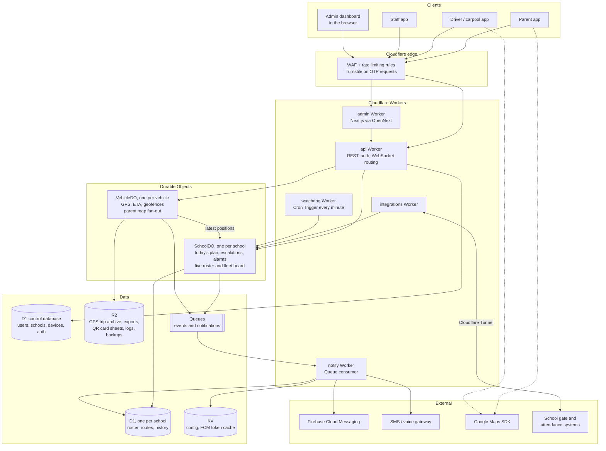
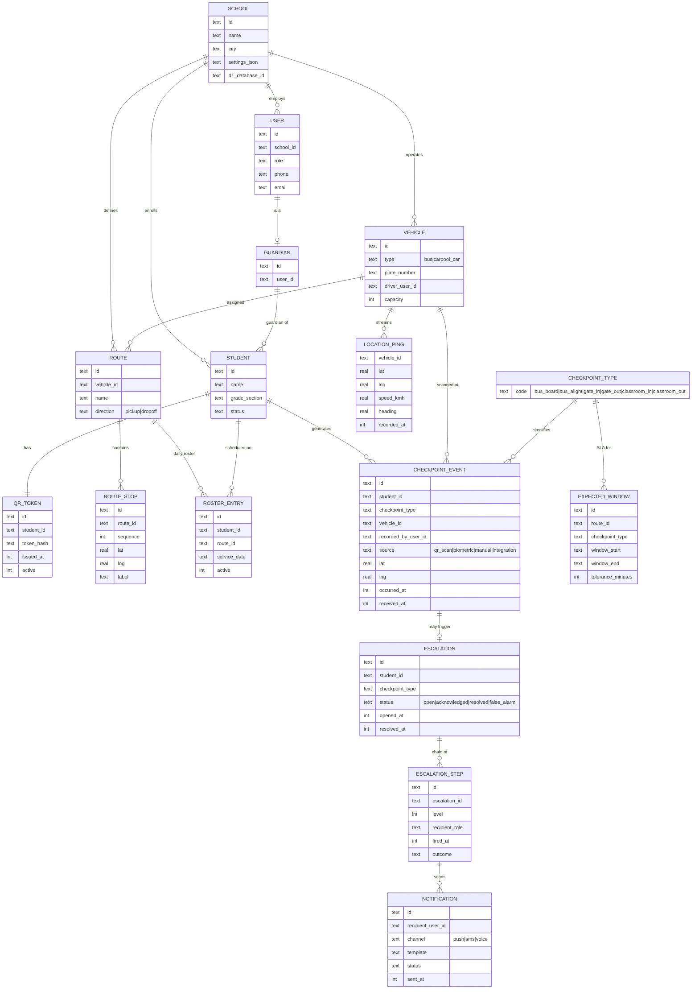
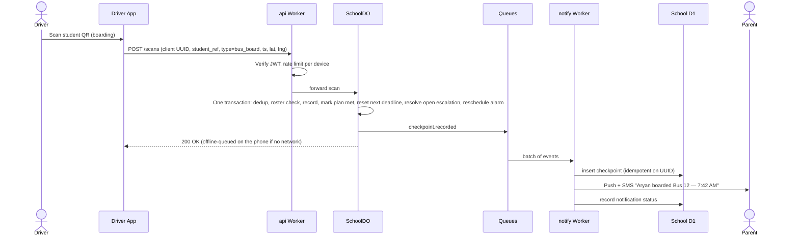
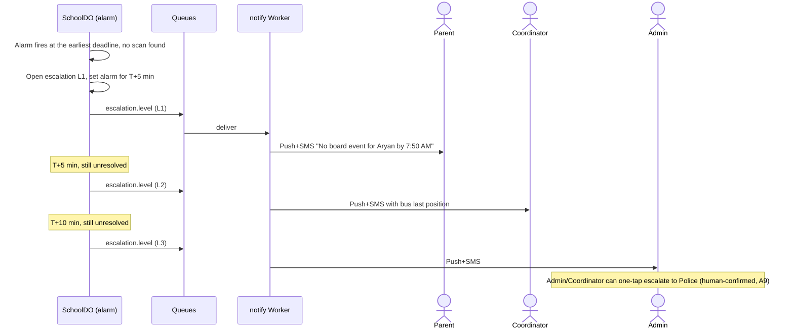
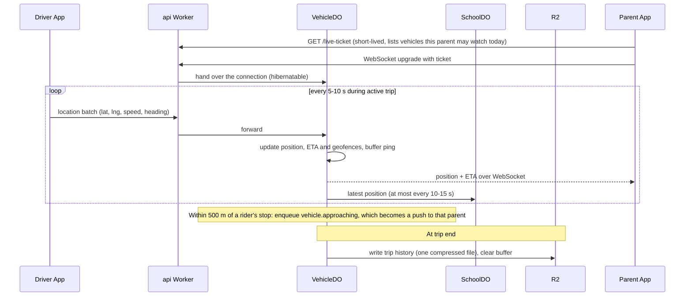

# StudeSafe — Software Architecture

> This is the **full-scale target** for a multi-school rollout. For the
> single-school prototype (500–1,000 students, one server), see
> [`PROTOTYPE_ARCHITECTURE.md`](./PROTOTYPE_ARCHITECTURE.md).

## 1. Purpose

StudeSafe replaces "track the child" with "track the handoff." Every point
where custody of a student changes hands (home → vehicle → school → vehicle →
home) is captured as a **checkpoint event**, confirmed by an adult already
present at that point (driver, gate guard, teacher). The system's job is to:

1. Capture checkpoint confirmations with minimal friction (QR scan).
2. Stream real-time vehicle location so parents can see the commute.
3. Notify parents at every checkpoint.
4. Detect missed/late checkpoints against expected time windows and escalate
   through a defined chain of humans.

This document describes the technical architecture that implements the
product description supplied by the team. Where the product description was
silent on an implementation detail, an explicit **Assumption** is called out
so it can be reviewed/corrected by stakeholders rather than silently baked
into the design.

**Confirmed technology stack** (see
[`REQUIREMENTS.md` §3](./REQUIREMENTS.md#3-confirmed--recommended-technology-stack)
for full detail): React Native (Expo) for all mobile apps, RTK Query, Google
Maps SDK, Firebase Cloud Messaging, and a **Cloudflare-native backend**:

- **Workers** for the API and the Next.js admin dashboard;
- **Durable Objects** for per-school checkpoint and escalation state and
  per-vehicle live location;
- **D1** for relational data, one database per school;
- **Queues** for events and notifications;
- **R2** for archives, exports and backups;
- **Tunnel** to reach school gate and attendance systems;
- **WAF rate limiting**, the Workers Rate Limiting API and **Turnstile** for
  abuse protection.

There are no servers, containers or clusters to operate. The diagrams and
component descriptions below use these concretely rather than listing
alternatives.

## 2. Actors / Roles

| Role | App surface | Primary actions |
|---|---|---|
| **Parent / Guardian** | Parent app (mobile) | View live map, timeline, receive & acknowledge alerts, manage student profile |
| **Driver (bus)** | Driver app (mobile) | Scan students in/out, broadcast "running late", location auto-streamed |
| **Carpool driver (parent)** | Driver app, "carpool mode" | Scan-in/out each rider, no hardware install |
| **Teacher / Gate guard** | Staff app (mobile) or web | Scan/confirm gate & classroom checkpoints |
| **Transport coordinator** | Admin dashboard (web) | Monitor fleet, receive level-2 escalations, reassign vehicles |
| **School admin** | Admin dashboard (web) | Roster management, routes, expected-time windows, receive level-3 escalations, bulk alerts |
| **System (automated)** | Escalation engine | Timer-based detection of missed checkpoints, automated notification fan-out |
| **Super admin (StudeSafe)** | Internal ops console | Multi-tenant (multi-school) provisioning, support |

**Assumption A1:** One codebase / one set of backend services serves all
roles; the *client experience* is role-gated (different navigation, screens,
and permissions), not a separate product per role. This matches "same app but
designed for different users… app views are different for each user type."

**Assumption A2:** The system is multi-tenant at the **school** level, and
each school gets its **own D1 database** (physical isolation per tenant).
On D1 this costs nothing extra (the platform is built for many small
databases), keeps each database far below D1's size limit, gives one
school's data a clean deletion and export boundary, and means a bad
query or migration can only ever touch one school. A small shared
**control** database holds what spans schools: user identities, the
school registry, devices and auth. This replaces the earlier plan of one
shared database partitioned by `school_id`.

## 3. High-Level Architecture

**Assumption A3:** Client ↔ backend communication goes through a single
`api` Worker acting as a Backend-for-Frontend (BFF): REST/JSON for CRUD
and history, and WebSocket upgrades for live location and live alerts.
The Worker authenticates the request, applies rate limits, then hands
WebSocket connections to the owning Durable Object (a vehicle's map to its
`VehicleDO`, a school's live board to its `SchoolDO`). Platform push
notifications (FCM) cover backgrounded apps.

**Why Durable Objects are the core.** Every piece of state that has to
be strongly consistent and time-driven lives in exactly one object: a
school's day (plans, deadlines, open escalations) in its `SchoolDO`, a
vehicle's position in its `VehicleDO`. Each object runs single-threaded,
so there are no race conditions between a late scan and an escalation
step. Its storage is transactional and durable, and its **alarm** is a
durable timer the platform retries until the handler succeeds. That one
primitive replaces Kafka, Redis and BullMQ/Temporal from a conventional
design.

## 4. Components (responsibilities)

The logical services are the same as a conventional design; the table
shows where each one runs.

| Service | Runs as | Stores in |
|---|---|---|
| Identity & Access | `api` Worker | D1 control database |
| Student & QR | `api` Worker | School D1; card sheets in R2 |
| Route & Roster | `api` Worker (admin CRUD), loaded daily into `SchoolDO` | School D1 |
| Checkpoint | `SchoolDO` | `SchoolDO` storage (today), school D1 (history) |
| Location | `VehicleDO` | `VehicleDO` storage (current trip), R2 (archive) |
| Expected-Window | `SchoolDO` alarm | `SchoolDO` storage |
| Escalation Engine | `SchoolDO` alarm | `SchoolDO` storage + school D1 |
| Notification | `notify` Worker (Queue consumer) | School D1 |
| Integration Adapter | `integrations` Worker + Cloudflare Tunnel | Feeds `SchoolDO` |
| Audit & Reporting | Queue consumers + `api` Worker | School D1, R2 exports |

### 4.1 Identity & Access
- AuthN (phone + OTP for mobile roles; see REQUIREMENTS FR-1.4) and AuthZ
  (RBAC: `parent`, `driver`, `teacher`, `gate_guard`, `coordinator`,
  `school_admin`, `super_admin`).
- Runs in the `api` Worker. OTP codes (hashed, 5-minute expiry), refresh
  tokens and devices live in the D1 control database, which is strongly
  consistent (unlike KV, which is not used for anything auth-related).
- OTP requests are protected three ways: **Turnstile** on the request, a
  **WAF rate limiting rule** at the edge (per IP), and the **Workers Rate
  Limiting API** in code (per phone number and per device). This stops
  bots triggering floods of paid SMS to premium numbers ("SMS pumping").
- Issues short-lived JWT access tokens (signed with WebCrypto) and
  rotating refresh tokens; device binding recommended for driver/teacher
  accounts since they represent duty-of-care actions.
- Guardian–student linking (a student can have multiple guardians; a
  guardian can have multiple students, including across schools for
  siblings — **Assumption A4**). The user identity is global (control
  database); each link lives in the school's database.

### 4.2 Student & QR Service
- Owns the student profile and the **QR token** printed/embedded on the ID
  card. The QR encodes an opaque, non-guessable student reference, **not**
  raw PII, so a photographed QR code leaks no personal data by itself
  (**Assumption A5**, since the brief explicitly wants to avoid
  privacy/surveillance concerns).
- Supports token rotation/reissue (lost card) without re-registering the
  student.
- Generates printable QR/ID-card sheets on demand; generated sheets are
  cached in R2 and served through signed, expiring URLs.

### 4.3 Route & Roster Service
- Vehicles (bus/carpool car), driver assignment, capacity.
- Routes: ordered stop sequence, coordinates per stop, schedule.
- Daily roster: which students are expected on which vehicle/route/day
  (supports ad-hoc changes — sick day, alternate pickup — **Assumption
  A6**: a parent or admin can mark a student "not travelling today" to
  suppress false missed-checkpoint escalations).
- Edited through the admin dashboard into the school's D1 database. Each
  morning a `SchoolDO` alarm loads that day's roster and routes from D1
  into the object's own storage, so scans are validated without a
  database round trip; roster edits during the day are pushed to the
  object immediately.

### 4.4 Checkpoint Service
- Single ingestion point for **all** checkpoint events regardless of
  source:
  - `bus_board`, `bus_alight` (QR scan by driver)
  - `gate_in`, `gate_out` (QR scan by guard, or an event from an existing
    biometric/RFID gate system via the Integration Adapter)
  - `classroom_in`, `classroom_out` (QR scan by teacher, or an event from
    the school's digital attendance system)
- The `api` Worker authenticates and rate-limits the request, then
  forwards it to the school's `SchoolDO`. In one storage transaction the
  object:
  - deduplicates on the client-generated UUID (so scan retries and offline
    batches can't double-count);
  - validates against today's roster (is this student expected on this
    route/vehicle; is this user authorized);
  - records the checkpoint and marks the matching expected checkpoint met;
  - resets the next checkpoint's deadline and, if it's now the earliest,
    reschedules the object's alarm;
  - resolves any open escalation for that checkpoint;
  - enqueues a `checkpoint.recorded` event on Cloudflare Queues.
- Queue consumers write the event to the school's D1 database (idempotent
  on the UUID) and send notifications, so a slow SMS provider never slows
  down a driver's scan.

### 4.5 Location Service
- One `VehicleDO` per vehicle. The driver app sends GPS batches while a
  trip is active (sampled every 5–10 s — **Assumption A7**).
- The object keeps the latest position in memory and storage, computes ETA
  to each stop and to school (route projection from the stops' coordinates
  and live speed; a routing API can be layered in later for traffic-aware
  ETA), and evaluates geofences (each stop, school) with plain distance
  math. No spatial database is needed for one route's handful of stops.
- **Live fan-out:** parents and coordinators watching this vehicle hold
  WebSocket connections to this object, using the Hibernation API so idle
  connections cost nothing between updates. Each position is broadcast to
  them directly.
- Sends a compact latest position to its school's `SchoolDO` (at most every
  10–15 s) for the fleet board and for escalation context ("bus last seen
  3 min ago, 2 km away").
- Emits `vehicle.approaching` events (for example, "bus is 500 m / ~3 min
  from home stop") onto Queues for notification.
- Buffers the trip's GPS points in its own storage. At trip end it writes
  the trip history to R2 as one compressed file and clears it from storage,
  so GPS volume never touches D1.
- An alarm detects a vehicle that stops reporting mid-trip and raises an
  operational alert (§7).

### 4.6 Expected-Window (SLA) Service
- Stores, per checkpoint type and per route/student, an expected time
  window (start, end, tolerance-minutes). Windows can be:
  - Set explicitly by school/transport office, or
  - Learned from historical checkpoint timestamps (rolling median ±
    configurable buffer) — **Assumption A8**: v1 ships with
    admin-configured static windows; adaptive/learned windows are a
    fast-follow, not a blocker for launch.
- Runs inside `SchoolDO`. Today's expected checkpoints for every student in
  the school sit in the object's storage. A Durable Object has one alarm
  at a time, so it is always set to the **earliest** pending deadline or
  escalation step. When it fires, the handler processes everything now
  due (marks misses, opens escalations) and sets the alarm for the next
  one. Alarms are retried by the platform until the handler succeeds, so
  the handler is written to be idempotent.

### 4.7 Escalation Engine
- Runs in the same `SchoolDO`, on the same alarm. Walks a configurable
  escalation chain, e.g.:
  1. **T+0**: alert parent (push + SMS)
  2. **T+5 min** (configurable), if unresolved: alert transport
     coordinator
  3. **T+10 min**: alert school admin
  4. **T+15 min** or admin-triggered: escalate to emergency contact /
     police
- "Unresolved" = no matching checkpoint event has since arrived **and** no
  human has acknowledged/closed the alert in the admin dashboard.
- Coordinator and admin alerts are grouped per vehicle when several
  students on one trip miss the same checkpoint, and include the vehicle's
  last known position from `VehicleDO`.
- **Assumption A9 (important safety/liability decision, flagged for
  explicit stakeholder sign-off):** the final "police" step is modeled as
  a **human-confirmed** action, not a fully automated outbound call. The
  engine escalates to the school admin/coordinator with a one-tap
  "Escalate to Police" action (which can auto-dial or trigger a
  dispatch-API integration where available) rather than autonomously
  phoning emergency services. Fully automated calls to police carry
  false-positive/liability risk (GPS gap, scanner offline, etc.) that a
  human-in-the-loop step mitigates; this can be revisited once the
  false-positive rate is measured in production.
- All escalation state transitions are audit-logged (who was notified,
  when, via what channel, and how/when it was resolved), via Queues into
  the school's D1 database.

### 4.8 Notification Service
- The `notify` Worker consumes notification events from Queues and fans
  out to Push (**Firebase Cloud Messaging**) and SMS/voice (India:
  MSG91/Exotel/Kaleyra, or Twilio) based on user notification preferences
  and escalation severity.
- FCM is called through its **HTTP v1 REST API**, because the Firebase
  Admin SDK depends on Node.js APIs the Workers runtime doesn't provide.
  The Worker mints a short-lived Google OAuth token from the service
  account with WebCrypto and caches it in KV until shortly before it
  expires.
- Persists `sent` / `delivered` / `failed` per notification in the
  school's D1 database (FCM alone offers no delivery dashboard), so the
  escalation path can be audited like any other safety-critical event.
- Failed sends are retried by Queues with backoff; messages that keep
  failing land in a dead-letter queue that alerts the on-call engineer.
- Templated messages per event type (`boarded`, `arrived`, `departed`,
  `reached_home`, `running_late`, `missed_checkpoint_L1..L3`,
  `bus_approaching`).
- Channel fallback (push fails → SMS) for anything escalation-related.

### 4.9 Integration Adapter
- The `integrations` Worker normalizes events from existing school
  gate/biometric and attendance systems into StudeSafe checkpoint events
  and sends them to the school's `SchoolDO`, the same path as a phone scan.
- School systems vary widely in maturity (**Assumption A10**), so three
  modes are supported:
  - **Webhook push:** the school system calls a public endpoint on the
    Worker, signed with a per-school HMAC secret and rate-limited.
  - **Pull over Cloudflare Tunnel:** for systems that sit on the school's
    local network, the school runs `cloudflared` on a small on-site machine.
    The Tunnel makes the local system reachable by the Worker only, with
    no inbound firewall ports opened at the school and access restricted by
    Cloudflare Access service tokens.
  - **Batch/SFTP:** a Cron Trigger pulls export files over the same Tunnel
    and stages them in R2 before import.

### 4.10 Audit & Reporting Service
- Append-only tables in each school's D1 database: every checkpoint, every
  notification sent, every escalation and its resolution. Queue consumers
  write them idempotently. Required for parent trust, school liability,
  and any future regulatory inquiry.
- The live board ("who's on which bus, who hasn't checked in") is served
  straight from `SchoolDO` over WebSocket; historical reports query D1
  (with D1 read replicas for heavy report queries).
- D1 Time Travel gives point-in-time restore of each school database; a
  nightly export of every school database to R2 keeps a longer archive
  outside D1.
- Operational metrics (scan rates, alarm lag, notification latency) go to
  Workers Analytics Engine.

## 5. Data Model (core entities)

D1 is SQLite, so IDs are stored as text UUIDs, timestamps as integers
(epoch milliseconds), coordinates as two real numbers and settings as
JSON text.

**Where each entity lives:**

- **D1 control database:** `SCHOOL` (registry and settings), `USER`,
  `DEVICE`, OTP codes, refresh tokens.
- **D1 database per school:** everything else below except `LOCATION_PING`.
- **`LOCATION_PING`:** never stored in D1. Held in the `VehicleDO`'s own
  storage during a trip, then archived to R2 as one file per trip.
- **Today's `EXPECTED_WINDOW` instances and open `ESCALATION`s:** the
  working copy lives in `SchoolDO` storage for speed and consistency;
  every change is also written to the school's D1 database for history.

## 6. Key Flows

### 6.1 Checkpoint scan → notification

### 6.2 Missed checkpoint → escalation

### 6.3 Live GPS tracking

## 7. Offline & Connectivity Resilience

Buses and carpool routes travel through areas with unreliable cellular
coverage. This is a hard product requirement even though it wasn't spelled
out explicitly (**Assumption A11**):

- Driver/Staff apps persist scans and GPS pings to an on-device queue
  (SQLite) and sync opportunistically; each event carries a client-generated
  UUID + `occurred_at` client timestamp so the backend can dedupe and
  preserve true event ordering even when `received_at` (server time) is much
  later.
- `SchoolDO` treats `occurred_at` as authoritative for escalation-window
  math and `received_at` for operational monitoring (detecting
  scanner/connectivity outages). A late-synced scan resolves any
  escalation it would have prevented.
- A prolonged sync gap on a vehicle (no location pings for > X minutes
  during an active trip) triggers the `VehicleDO`'s alarm and is surfaced
  to the Admin Dashboard as an operational alert distinct from a
  missed-student-checkpoint alert.

## 8. Security & Privacy

- **No origin servers.** Everything runs on Workers and Durable Objects,
  so there are no inbound ports, SSH keys or operating systems to patch.
  The only private network path is Cloudflare Tunnel into a school's
  network (§4.9), which opens no inbound ports at the school either.
- **Abuse protection at three layers:** WAF rate limiting rules at the
  edge (OTP, login, scan and location endpoints, per IP), the Workers Rate
  Limiting API in code (per phone number, per user, per device), and
  Turnstile on OTP requests.
- **QR tokens carry no PII** (A5) — only an opaque per-student reference,
  rotatable if a card is lost/stolen, so a found/photographed badge does not
  leak the child's identity or schedule to a stranger.
- Role-based access control everywhere, enforced in the Workers and Durable
  Objects, never only in the UI; a driver can only see students on their
  assigned vehicle/route for today, a teacher only their school/class, a
  parent only their own children. A parent's live-map WebSocket requires a
  short-lived signed ticket naming the vehicles they may watch that day.
- TLS terminates at Cloudflare's edge; traffic between Workers, Durable
  Objects, D1, R2 and Queues stays inside Cloudflare's network. Cloudflare
  encrypts D1, Durable Object storage and R2 at rest.
- Secrets (FCM service account, SMS keys, JWT signing key, HMAC secrets)
  are Workers secrets, never in code or config files.
- Internal tools (super-admin console, support views) sit behind
  **Cloudflare Access** with the team's identity provider.
- PII (student name, home address/geofence, guardian contacts) is treated
  as sensitive personal data; India's **Digital Personal Data Protection
  Act, 2023 (DPDP)** applies — processing a minor's data requires verifiable
  parental/guardian consent and a Data Protection Officer / grievance
  contact for the operating entity (**Assumption A12**, flagged for legal
  review, not just engineering).
- **Data location (Assumption A14):** D1, Durable Objects and R2 accept a
  location hint (Asia-Pacific) but offer no India-only jurisdiction, so
  primary data is stored in Cloudflare's Asia-Pacific locations, not
  guaranteed inside India. The DPDP Act permits transfers abroad except to
  countries the government restricts, but individual school contracts or
  sector rules may require India-only storage. **Needs legal review before
  the first contract**; see open question 6.
- Location history and checkpoint logs are retained for a bounded period
  (e.g. 12 months, configurable per school contract) then purged/archived —
  **Assumption A13**, exact retention period is a policy decision, not an
  engineering one. R2 lifecycle rules expire trip archives and exports;
  a Cron Trigger purges expired D1 rows.
- The audit log is append-only (Queue consumers only insert, never update or
  delete) given its role in disputes ("was the escalation actually sent on
  time").

## 9. Scalability & Deployment

- **Scaling is by sharding, not by adding servers.** Workers scale
  automatically. Durable Objects shard the hot state naturally: one
  `SchoolDO` per school and one `VehicleDO` per vehicle, each handling
  its own traffic independently. A single Durable Object handles on the
  order of a thousand requests per second; the largest school's gate rush
  (a few thousand scans in 15 minutes) and a vehicle's viewers (tens of
  parents) are far below that.
- **Hibernating WebSockets** let the O(100,000) parent map connections of
  NFR-4 stay open without paying for idle time; each vehicle's object only
  wakes to broadcast a new position.
- **Queues** decouple ingestion from downstream processing (notifications,
  D1 history writes, audit) so a slow SMS provider never blocks a scan,
  with automatic retries and a dead-letter queue.
- **D1 per school** keeps every database small (years of one school's
  history stay well inside D1's per-database size limit, about 10 GB at
  the time of writing) and spreads write load across thousands of
  databases instead of one.
- **GPS never touches D1:** points are buffered in `VehicleDO` storage and
  archived to R2 per trip, which removes the highest-volume write stream
  from the relational store entirely.
- **Deployment:** Workers, Durable Object classes, Queues, D1 bindings
  and Cron Triggers are defined in `wrangler` configuration and deployed
  from GitHub Actions with staging and production environments. The
  Next.js admin dashboard deploys to Workers with the OpenNext adapter.
  D1 schema migrations run through `wrangler d1 migrations`, fanned out to
  every school database by a deploy script, with the control database
  first.
- **Infrastructure as code:** Terraform's Cloudflare provider manages
  DNS, WAF and rate limiting rules, Turnstile widgets, Access
  applications, Tunnels and R2 buckets with their lifecycle rules.
- **Monitoring the safety path:** the `watchdog` Worker runs every minute
  (Cron Trigger) and checks that every active `SchoolDO` has processed its
  alarm on time and that notification queue lag is within bounds; any
  breach pages the on-call engineer. Workers Logs (with Logpush to R2 for
  retention), Workers Analytics Engine metrics and Sentry (the Cloudflare
  SDK) cover errors and performance.
- **Region (Assumption A14, revised):** Workers run at the Cloudflare
  location nearest each user, including locations in India, so request
  latency is low. Stateful components (Durable Objects, D1, R2) are placed
  with an Asia-Pacific location hint; see §8 for the data-location caveat.
- **Vendor concentration (Assumption A15, replaces the old multi-cloud
  note):** apart from Google (FCM, Maps) and the SMS gateway, the whole
  backend now depends on Cloudflare. A Cloudflare incident affecting
  Workers, Durable Objects or D1 is a full outage of the safety path.
  This is accepted in exchange for having no infrastructure to operate;
  the mobile apps' local "overdue" display and staff runbooks for manual
  checks are the mitigation.

## 10. Open Questions for Product/Stakeholders

1. Confirmed policy on automated vs. human-confirmed police escalation
   (A9) — legal/liability sign-off needed.
2. Data retention period per data type (A13).
3. Whether school biometric integrations are push (webhook) or pull
   (Tunnel or batch) in the actual pilot schools (A10) — affects which
   Integration Adapter mode is built first.
4. Whether adaptive/learned expected-time windows are needed for v1 or a
   v2 feature (A8).
5. Multi-school siblings / a guardian with children at different schools
   (A4) — confirm this is in scope for v1.
6. **Data location.** Is Asia-Pacific storage (not India-only) acceptable
   under the DPDP Act and each school's contract (A14)? If a school requires
   India-only storage, that school's data cannot use D1, Durable Objects or
   R2 as designed.
7. **Platform limits.** Cloudflare's D1, Durable Object and Queues limits
   quoted here are approximate and change over time; confirm them against
   current documentation before committing to the per-school database
   design (A2) at district scale.
